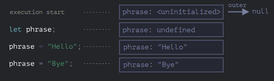

# Advanced working with functions: Variable scope, closure

This article is about variable scope and closure in JavaScript.

## Lexical Environment
Every running *function*, *code block* `{...}`, and the *script* as a whole have an internal object known as **Lexical Environment**. 

### Step 1. Variables
#### Structure of the Lexical Environment
The object consist of two parts:
* *Environment Record* - an object that stores all local variables as its properties (and some other informations like the value of `this`)
* A reference to the outer LE, the one associated with the outer code.

#### Lexical Environment during the execution

1. The LE is pre-populated with all declared variables. It means that the engine knows about the variable, but it cannot be referenced until it has been declared with `let`.
2. The `let prase` appears. There's no assigment yet, so its value is `undefined`
3. `phrase` is assigned a value.
4. `phrase` changes the value.

### Step 3. Function Declarations

A function is also a variable.

**The difference is that a Function Declaration is instantly fully initialized.**

### Step 4. Inner and outer Lexical Environment
When the code wants to access a variable - the inner LE is searched first, then the outer one until the global one.

For compatibility with old code, if a variable isn't found, it will be created in the gloabl scope.

### Step 4. Returning a function
All functions have an internal property *Environment*, that keeps the reference to the LE where the function was created.

A clousure is a function that remembers its outer variables and access them. 

In JavaScript all functions are clousures.

## Garbage Collection
A LE is removed from memory with all all variables after the function call finishes.

If there is a nasted function that is still reachable the outer LE stays alive.

### Real-live optimizations
In the V8 engine, if it is obvious from the code that some outer variable is not used - it is removed.

## Questions
1. What is the Lexical Environment?
2. Describe a structure of the Lexical Environment.
3. Describe the phases of the Lexical Environment during execution.
4. How does function creation look like?
5. What does it happen when the code wants to access a variable?
6. What does it happen when the code didn't find a variable?
7. What is a clousure?
8. How do clousures work in JS?
9. How does the GC work with closures?
10. Describe optimization of the V8 engine.