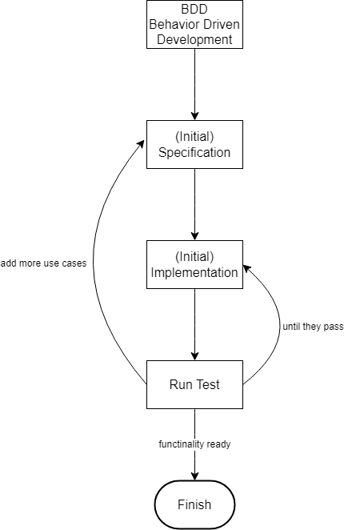

# Code Quality: Automated Testing With Mocha

This article is about automatic testing with Mocha.

## BDD
The following diagram shows how to write test according to BDD style.

> One test checks one thing.

> Use `it.only(...)` to run test in standalone mode.

## Why do we test software?
- A well-tested code has better architecture.
- Lack of testing makes the code obsolate as no one wants to touch it.

## Questions
1. How to write tests according to BDD style?
2. How many things should we test in one test?
3. How to run test in standalone mode?
4. Why should we write good tests?