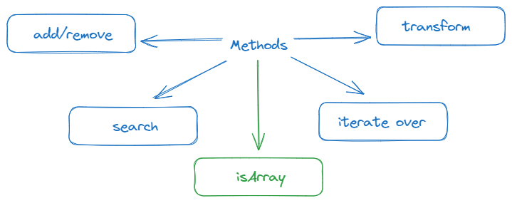

# Data types: Array methods

This article is about array methods in JavaScript.

## Splice
It is a swiss army knife for arrays. It can do everything: **insert**, **remove** and **replace** items.

`arr.splice(start[, deleteCount, elem1, ..., elemN])`

*start* - index from we start.

*deleteCound* - number of elements to remove.

*item1,...,itemN* - new items that will be inserted at *start* position.

It returns the deleted items.

## Slice
It copies elements of an array.

`arr.slice([start], [end])`

It returns a copy of the array starting from *start* and ending at *end* (not including *end*). The arguments can be negative, in that case position from array end is assumed.

We can use the method without the arguments, then it returns a copy of the array.

## Concat
The method returns a new array that includes values from other arrays and additional items.

`arr.concat(arg1, arg2...)`

If an argument *argN* is an array, then all its elements are copied. Otherwise, the argument itself is copied.

- array and primitivs → copied by value.
- objects → copied by reference.

## Iterate: forEach
The method allows to run a function for every element of the array.

`arr.forEach(function(item, index, array) {
  // ... do something with item
});`

## Searching
### indexOf, lastIndexOf, includes
They work the same way as for strings. `indexOf` and `lastIndexOf` use strict equality.

🚩`includes` in comparison to `indexOf` correctly handles `NaN`.

```javascript
const arr = [NaN];
alert( arr.indexOf(NaN) ); // -1 (wrong, should be 0)
alert( arr.includes(NaN) );// true (correct)
```

### find, findIndex, findLastIndex
The following methods are perfect in the case of working with arrays of objects.

`find(callbackFn)`

The function is called for elements of the array, one after another:

- *item* is the element.
- *index* is its index.
- *array* is the array itself.

If it returns `true`, the search is stopped, **the item is returned**. If nothing found, `undefined` is returned.

`findIndex(callbackFn)`

The method has the same syntax, but returns the *index* where the element was found instead of the element itself. The value of -1 is returned if nothing is found.

`findLastIndex(callbackFn)`

The arr.findLastIndex method is like `findIndex`, but searches from right to left, similar to `lastIndexOf`.

`filter(callbackFn)`

The method is similar to `find` but returns an array of all matching elements.

## Transforming
### map, sort, reverse, split, join, reduce, reduceRight
There are methods that transform and reorder an array.

`map(callbackFn)` 

It calls the function for each element of the array and returns the array of results.

```javascript
let result = arr.map(function(item, index, array) {
  // returns the new value instead of item
});
```

`sort(compareFn)`

The call to method sorts the array in place, changing its element order.

**The items are sorted as strings by default.**

`reverse()`

The method method reverses the order of elements in arr in place.

`split(delim)`

It splits the string into an array by the given delimiter delim.

`join(glue)`

It creates a string of arr items joined by glue between them.

`reduce()/reduceRight()`

The methods calculate a single value based on the array.

The method arr.reduceRight does the same, but goes from right to left.

```javascript
let value = arr.reduce(function(accumulator, item, index, array) {
  // ...
}, [initial]);
```

## isArray
Arrays are based on objects, so `typeof` doesn't help us to distinguish plain object from an array.

```javascript
alert(typeof {}); // object
alert(typeof []); // object (same)
```

Instead of that we need to use a special method for that: `Array.isArray(value)`.

```javascript
alert(Array.isArray({})); // false

alert(Array.isArray([])); // true
```



## Questions
1. What method allows us to insert, delete and replace array items?
2. What method allows us to copy elements of an array or the array itself?
3. What method allows us to join different arrays?
4. What method allows us to run a function for every item of the array?
5. How does `indexOf` and `includes` work with arrays?
6. What methods make it easier to work with arrays of objects?
7. Why do the make it easier to work with objects?
8. What methods allow us to transform array?
9. How can we check if value is an array?