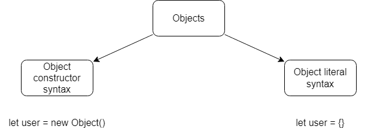

# Objects the basics: Objects

This article is about objects in JavaScript.

## Create


## Properties
### Add
In order to add some property we use `object.propertyName = value`
### Delete
In order to delete some property we use `delete object.propertyName`

## Square brackets
We can use properties whose names are strings with space. To access them, we need to use square brackets `object["property name"]`

## Computed properties
If we need to proccess an object's property name, we should use *computed properties*.

Allows us to read the name of the property from a variable or perform additional actions to resolve the final name of the property.

```javascript
// read prop from var
let fruit = 'apple';
let bag = {
    [fruit]: 5,
}

// additional actions
bug[fruit + '_eco'] = 5;
```

## Property value shorthand
We can use shortdand when variable's name that we are assigning to the object corresponds to its property name.

```javascript
function(name) {
    return {
        name // instead of name:name
    }
}
```

## Property names limitations
We can use language-reserved words as properties names like `for` or `return` because they all are converted to `string`.

Everything what is not `string` or `Symbol` is automatically converted to `string`.

## Property existence test, "in" operator
In JavaScript, if we try to access a property that does not exist we get `undefined`, it will never end up with an error.

But if we want to check if a property exists we can use `in` operator.

```javascript
"key" in object
```

If a property exists but is equal to `undefined`, it returns `true`. We get `false` only when the property doesn't exist.

## The `for..in` loop
Using this loop we can go through all the properties of the object.

```javascript
for (let key in object) {
    conosle.log(object[key]);
}
```

## Orderd like an object
Integer properties of the objects are sorted, others appear in creation order.

## Questions
1. How can we create object? (syntax)
2. How can we add a new property to the object? (syntax)
3. How can we remove a property from an object? (syntax)
4. How can we user objects whose properties are strings with spaces? (syntax)
5. How we can add properties from variables? (syntax)
6. What is the property value shorthand syntax?
7. What are properties names limitations?
8. What kind of types can be used as objects properties?
9. How does the `in` operator work?
10. How can we go throught all the properties of the object?
11. What is the order of the object's properties?